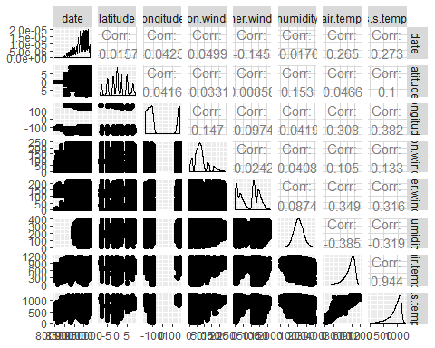

# Data Reading 

Before anything else, we will need the following tools to do our analysis:

```{r message=FALSE, warning=FALSE}
library(plyr)
library(dplyr)
library(tidyverse)
library(gtools)
library(knitr)
library(openxlsx)
library(GGally)
library(caret)
library(car)
library(pROC)
```

Looking at the data, it appears that tao-all2.dat.gz has the data we need. We read the said data:

```{r}
elnino <- read.table('tao-all2.dat')
elnino %>% head()
```

Here, we can see that the names of the columns are missing. We incorporate this in the dataset:

```{r}
name <- c('obs','year','month','day','date','latitude',
          'longitude','zon.winds','mer.winds','humidity',
          'air temp.','s.s.temp.')
names(elnino) <- name
elnino %>% head() 
```

Looking at the values of the last 5 columns, they were considered as factors. It seems that the '." was not considered as NA values. We fix that:

```{r}
elnino[elnino == "."] <- NA
elnino_new <- lapply(elnino, as.numeric) %>% as.data.frame()
elnino_new %>% head()
```

The following are the variables for this dataset: date, latitude, longitude, zonal winds (west<0, east>0), meridional winds (south<0, north>0), relative humidity, air temperature, sea surface temperature and subsurface temperatures down to a depth of 500 meters.

# Exploratory Analysis

First, we check the size of the dataset:

```{r}
elnino_new %>% nrow()
elnino_new %>% length()
```

We can see that there are 12 columns and 178,080 observations. However, upon further observations, the first 4 columns does not have any significance for us. We now look at the summary statistics of the variables:

```{r}
elninodata <- elnino_new[,-c(1:4)]
elninodata %>% summary()
```

We also would like to look at the histogram of the date, so we can see the distribution of observations based on time:

```{r}
hist(elninodata$date, main = 'Histogram of Observations', 
     xlab = 'Date of Observation')
```

From here, we can see that as time passes (at around 1993 to 1994), there has been an increase in the number of observations. We also check the histogram of the longitude and latitude:

```{r}
par(mfrow=c(1,2))
hist(elninodata$latitude, main = "Histogram of Latitude", 
     xlab = "Latitude")
hist(elninodata$longitude, main = "Histogram of Longitude", 
     xlab = "Longitude")
```

Here, we can see that the longtitude has more values at around -150 and 150 while latitude has a more normal distribution. Finally, we check the values for the other variables:

```{r}
par(mfrow=c(3,2))
hist(elninodata$zon.winds, main = "Histogram of Zonal Winds", 
     xlab = "Zonal Winds")
hist(elninodata$mer.winds, main = "Histogram of Meridional Winds", 
     xlab = "Meridional Winds")
hist(elninodata$humidity, main = "Histogram of Humidity", 
     xlab = "Humidity")
hist(elninodata$air.temp., main = "Histogram of Air Temperature", 
     xlab = "Air Temperature")
hist(elninodata$s.s.temp., main = "Histogram of Sea Surface Temperature", 
     xlab = "Sea Surface Temperature")
```

From the plots above, we can see that the Zonal Winds have a peak around 70. For Meridional Winds, the distribution appears to a peak around 0 and another at 110. Humidity, Air Temperature and Sea Surface Temperature distribution appears to be relatively normal, with the latter two being skewed to the right.

# Knowledge Discovery

We look at the correlation of the variables with each other as seen in Figure 1 using the code below:

```{r eval=FALSE, warning=FALSE}
## ggpairs(elninodata, progress = F) 
#^above was preloaded so, it won't affect the RMarkdown file.
```



From the correlation plot above, we can see that air temperature is highly correlated to the sea surface temperature. As such, we would like to remove air temperature in our analysis since we want to know the variables affecting sea surface temperature.

We split the data in a test and train split:

```{r}
smp_size <- floor(0.75 * nrow(elninodata))
set.seed(123)
train_ind <- sample(seq_len(nrow(elninodata)), size = smp_size)

elnino_train <- elninodata[train_ind, ]
elnino_train <- elnino_train[,-c(1,7)] %>% na.omit()

elnino_test <- elninodata[-train_ind, ]
elnino_test <- elnino_test[,-c(1,7)] %>% na.omit()
```

We fit a linear model:

```{r}
full_model <- lm(s.s.temp. ~ ., data=elnino_train)
full_model %>% summary
```
From here, we can see that all of the variables are significant with a significant over-all p-value. As such, we can say that the sea surface can be modelled using all other variables.

We look at the model:

```{r}
par(mfrow=c(2,2))
plot(full_model)
```

We also look at the VIF:

```{r}
full_model %>% vif
```

It appears that our model is looking healthy. As such, we would consider full model as our model.

We look at the prediction power:

```{r}
# Test set performance benchmark
evaluateRMSE <- function(model, df_set) {
  predictions <- model %>% predict(df_set) %>% as.vector()
  obs <- df_set$s.s.temp. %>% as.vector()
  rmse <- sqrt(mean((predictions - obs)^2)) / (mean(obs))
  return(rmse)
}

evaluateRMSE(full_model, elnino_test)
```

As such, our error is 16.86%.

